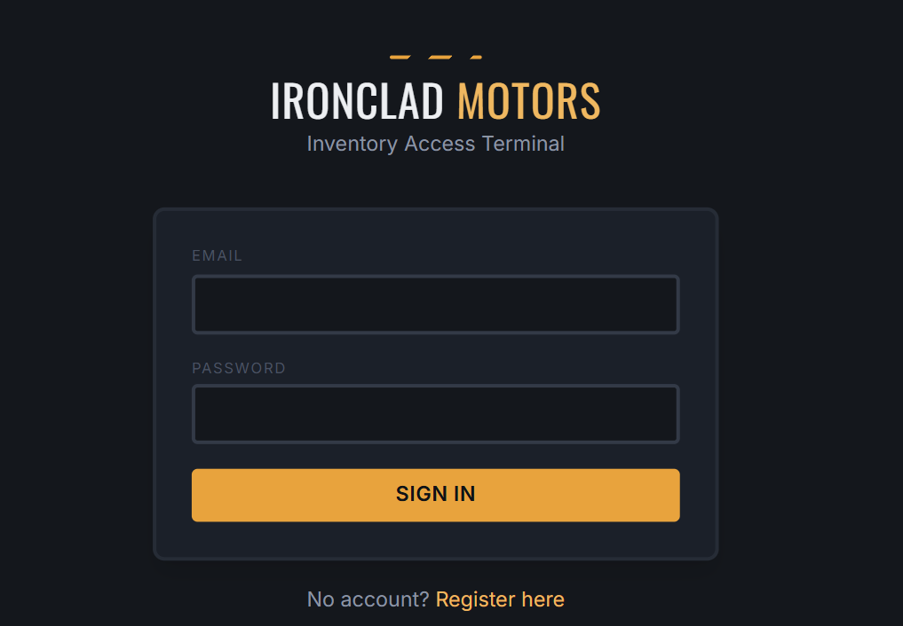
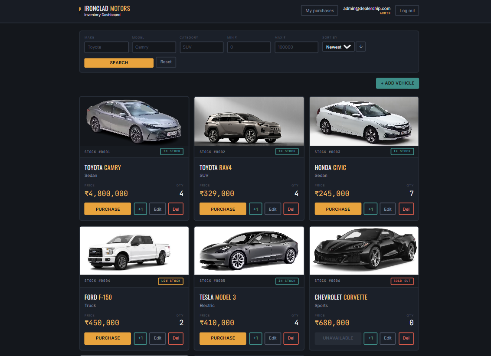
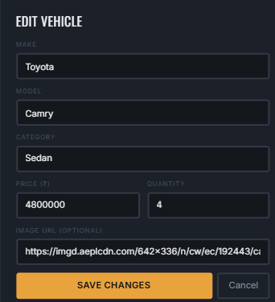
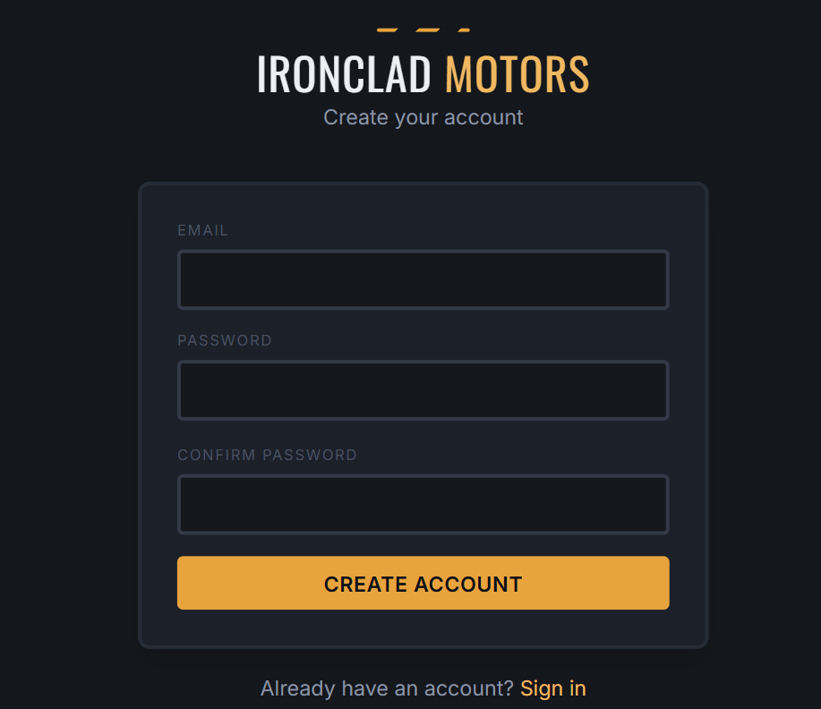
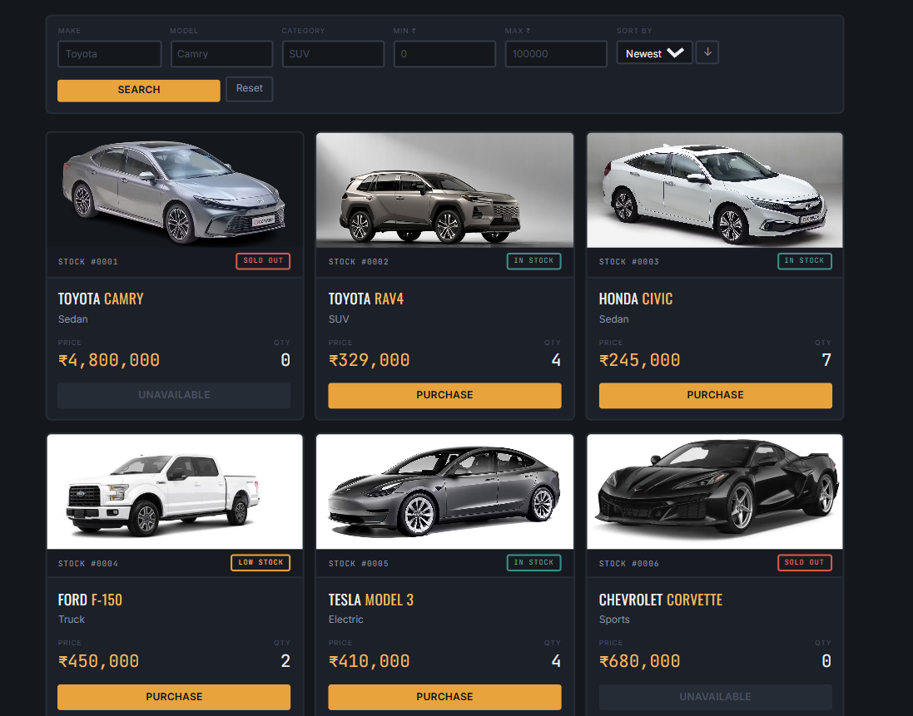

# Ironclad Motors — Car Dealership Inventory System

A full-stack inventory management system for a car dealership: token-authenticated
users can browse, search, sort, and purchase vehicles (with photos and an order
history); admins can add, edit, delete, and restock inventory. Built as a TDD kata.

- **Backend**: Node.js, TypeScript, Express, SQLite (via Node's built-in `node:sqlite`), JWT auth
- **Frontend**: React, TypeScript, Vite, Tailwind CSS v4
- **Testing**: Jest + Supertest, 45 tests, ~90%+ statement coverage on the backend
- **CI**: GitHub Actions runs tests + builds on every push (see `.github/workflows/ci.yml`)

### Feature highlights
- Vehicle browsing with photos, search/filter, and sorting (by price, make, stock, newest)
- Purchase flow that records a full order history per user (`/api/orders`), with an
  admin view across all customers
- Role-based access: regular users can browse/search/purchase; admins can additionally
  add/edit/delete/restock vehicles and view all customer orders

---

## Project structure

```
car-dealership/
├── backend/               Express API, SQLite database, JWT auth, tests
├── frontend/                React + Vite + Tailwind SPA
├── .github/workflows/ci.yml GitHub Actions: tests + builds on every push
├── render.yaml               One-click deployment blueprint for Render.com
├── TEST_REPORT.txt          Latest backend test run + coverage output
└── PROMPTS.md                AI chat/prompt history for this project
```

---

## Setup & running locally

### Prerequisites
- Node.js 22+ (this project uses Node's built-in `node:sqlite` module, which requires Node 22.5+ and is currently marked experimental — you'll see a harmless `ExperimentalWarning` in the console, which is expected)
- npm

### 1. Backend

```bash
cd backend
npm install
cp .env.example .env      # adjust JWT_SECRET etc. if you like
npm run seed               # creates the SQLite DB + demo admin/user accounts + sample vehicles
npm run dev                 # starts the API on http://localhost:4000
```

Demo accounts created by the seed script:

| Role  | Email                  | Password       |
|-------|-------------------------|----------------|
| Admin | admin@dealership.com    | AdminPass123   |
| User  | user@dealership.com     | UserPass123    |

Run the test suite:

```bash
npm test               # run all tests
npm run test:coverage  # run tests with a coverage report
```

Build for production:

```bash
npm run build
npm start
```

### 2. Frontend

In a second terminal:

```bash
cd frontend
npm install
npm run dev   # starts the SPA on http://localhost:5173, proxying /api to :4000
```

Open http://localhost:5173, log in with one of the demo accounts above (or register
a new one — new accounts default to the `user` role), and browse the inventory.

Build for production:

```bash
npm run build
npm run preview
```

---

## API overview

| Method | Endpoint                         | Auth          | Description                          |
|--------|-----------------------------------|---------------|----------------------------------------|
| POST   | `/api/auth/register`              | —             | Create an account                     |
| POST   | `/api/auth/login`                 | —             | Log in, receive a JWT                 |
| GET    | `/api/vehicles`                   | user          | List all vehicles (supports `?sortBy=price\|make\|quantity\|created_at&sortOrder=asc\|desc`) |
| GET    | `/api/vehicles/search`            | user          | Filter by make/model/category/price, plus the same sort params |
| POST   | `/api/vehicles`                   | user          | Add a vehicle (accepts an optional `image_url`) |
| PUT    | `/api/vehicles/:id`                | user          | Update a vehicle                      |
| DELETE | `/api/vehicles/:id`                | admin         | Delete a vehicle                      |
| POST   | `/api/vehicles/:id/purchase`       | user          | Decrease quantity, records an order   |
| POST   | `/api/vehicles/:id/restock`        | admin         | Increase quantity                     |
| GET    | `/api/orders`                     | user          | Your own purchase history (admins: add `?all=true` for everyone's) |

All protected routes require an `Authorization: Bearer <token>` header.

---

## Continuous integration

Every push and pull request runs `.github/workflows/ci.yml`, which:
1. Installs backend dependencies, runs the full test suite with coverage, and does a TypeScript build
2. Installs frontend dependencies and does a TypeScript + Vite production build

This catches broken tests or compile errors before they reach `main`.

## Deployment

A [Render.com](https://render.com) blueprint is included at `render.yaml`, which deploys:
- The backend as a Node web service, with a persistent disk mounted at `/var/data` so
  the SQLite database survives restarts and redeploys
- The frontend as a static site

To deploy: push this repo to GitHub, then in Render choose **New → Blueprint** and point
it at your repo — it will read `render.yaml` and provision both services automatically.

One manual step after the first deploy: set the frontend's `VITE_API_URL` environment
variable in Render to your backend service's URL (e.g. `https://car-dealership-api.onrender.com`)
and redeploy the frontend, so it knows where to send API requests instead of relying on
the local dev proxy.

You can deploy the backend and frontend to any other Node-friendly host (Railway, Fly.io,
Vercel + a separate backend host, etc.) the same way — just make sure `VITE_API_URL` is
set at frontend build time.

---

## Design notes

- **Database**: I used Node's built-in `node:sqlite` module rather than a third-party
  binding like `better-sqlite3`. It's a real, file-backed, persistent SQLite database
  (not in-memory), and avoids native-module build issues while keeping the same
  synchronous, prepared-statement API style.
- **Auth**: passwords are hashed with bcrypt; JWTs carry `userId`, `email`, and `role`
  and are verified on every protected route via middleware. Admin-only routes layer
  a second `requireAdmin` check on top of `requireAuth`.
- **Validation**: request bodies are validated with `zod` schemas before touching the
  database layer.
- **Frontend**: a small "showroom" visual identity (graphite background, amber/teal
  accents, condensed display type) rather than default component-library styling,
  built with Tailwind v4.

---

## My AI Usage

**Tools used:** Claude (Anthropic).
**How I used it:**
- I used Claude to scaffold the entire project end-to-end: the Express/TypeScript
  backend structure (routes, middleware, repository layer, validation schemas), the
  Jest/Supertest test suite (written and run before/alongside the implementation in a
  red-green loop), and the React/Vite/Tailwind frontend (pages, components, API
  client, auth context).
- I asked Claude to research and choose a SQLite approach that would avoid
  native-binding install issues in a constrained sandbox — it landed on Node's
  built-in `node:sqlite` module after testing it directly, rather than assuming
  `better-sqlite3` would work.
- I had Claude actually run the test suite, the TypeScript build for both backend and
  frontend, and a live smoke test of the running server (health check, login, JWT
  issuance) rather than just generating code it assumed would work — several bugs
  (a TypeScript casting issue in the SQLite repository layer, `verbatimModuleSyntax`
  type-import errors across ~10 frontend files) were caught and fixed this way before
  delivery.
- I asked for a deliberate, non-templated visual design for the frontend (a
  "dealership showroom" aesthetic) rather than default Tailwind styling.

**Reflection:** Using an agentic coding assistant that can install dependencies, run
tests, and inspect real output (rather than just generate code from a prompt) caught
real bugs before I ever ran the project myself — the type-import errors in particular
would have been a tedious one-by-one fix cycle. The main thing I had to stay
deliberate about was architecture decisions (e.g., the database approach, validation
strategy, auth middleware layering) — I reviewed and directed those rather than
accepting the first suggestion, since that's where judgment matters most.

**Follow-up session:** After the initial build, I asked Claude to add three
enhancements on top of the base kata requirements: an order/purchase history
feature, sorting and vehicle images, and a CI + deployment setup. Claude added a
new `orders` table and repository, wired order creation into the existing purchase
endpoint, added sort parameters to the vehicle list/search endpoints, added an
`image_url` column with a defensive migration for already-existing databases, wrote
10 new backend tests for the new behavior (all passing alongside the original 35),
and added a GitHub Actions CI workflow plus a Render.com deployment blueprint. It
also caught and fixed the same category of `node:sqlite` return-type casting issue
it had hit before, and updated the frontend's API client to support a configurable
backend URL for production deployments (since the local dev proxy only works on
localhost) — something I hadn't thought to ask for but was necessary for the
deployment config to actually work.

---

## Test report

See [`TEST_REPORT.txt`](./TEST_REPORT.txt) for the latest full test run and coverage
output (35/35 tests passing, ~92% statement coverage on the backend). Regenerate it
anytime with `npm run test:coverage` in `backend/`.
## Screenshots

### Login page


### Dashboard — Admin view


### Add vehicle form (admin only)


### My Purchases (order history)


### User registration page


### Dashboard — Regular user view
